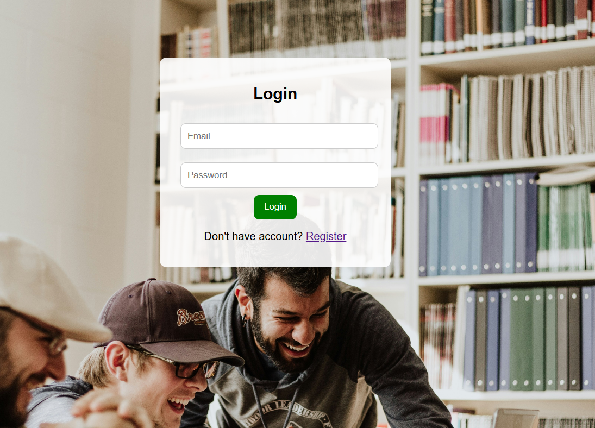
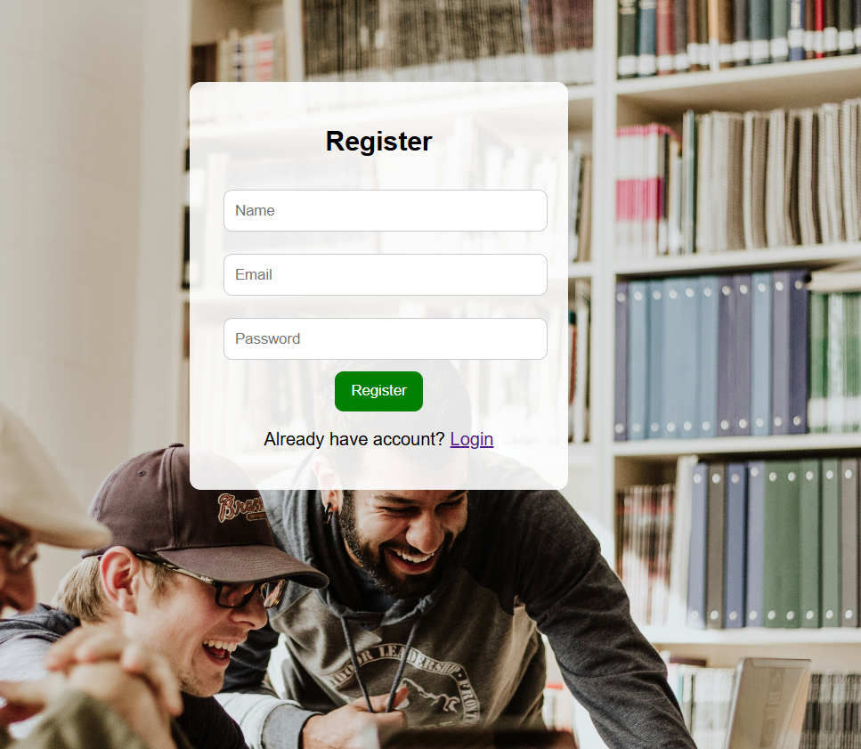
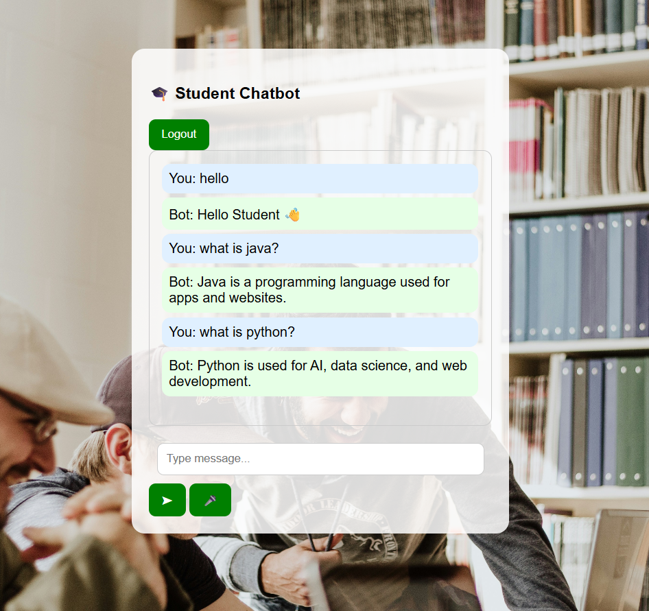

# 🎓 Student Chatbot System

A simple web-based Student Chatbot built using HTML, CSS, and JavaScript.  
It includes login, registration, chatbot with smart replies, voice input, and chat history using localStorage.

---

## 🚀 Features

✔ User Registration & Login system (localStorage)  
✔ WhatsApp-style Chat UI 💬  
✔ Smart Chatbot responses 🤖  
✔ Voice Input (Speech Recognition 🎤)  
✔ Voice Output (Text to Speech 🔊)  

---

## 🧑‍💻 Tech Stack

HTML • CSS • JavaScript • Web Speech API • LocalStorage

---

## 📁 Project Files

- index.html → Login Page  
- register.html → Register Page  
- chatbot.html → Chatbot UI  
- style.css → Styling  
- script.js → Logic  

---

## 📸 Screenshots

### 🔐 Login Page

### 📝 Register Page

### 🛍️ Dashboard

---

## ⚙️ How to Run

1. Download or clone the project  
2. Open `index.html` in browser  
3. Register new user  
4. Login with credentials  
5. Start chatting 🤖  

---

## 🧪 Sample Chat

User: hello  
Bot: Hello 👋  

User: java  
Bot: Java is a programming language used for apps and websites  

User: python  
Bot: Python is used for AI and web development  

User: web development  
Bot: Web Development means building websites using HTML, CSS, JS  

---

## 🎤 Voice Feature

Click 🎤 button and speak:
- hello  
- what is java  
- python  

Bot will respond automatically.

---

## 🔥 Future Improvements

- Real AI chatbot (ChatGPT API 🤖)  
- Firebase database integration  
- Multi-user chat system  
- Dark mode UI 🌙  
- Delete chat feature 🗑️  

---

## 👨‍💻 Author

Developed by: **B.Satya Hyndavi**  

